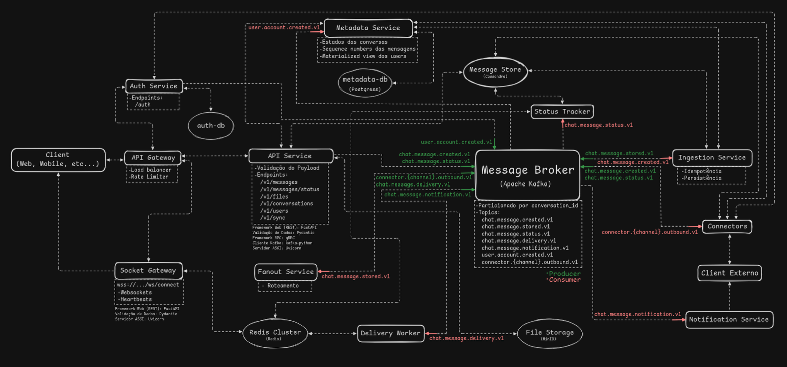

# Chat4All - Sistema de Mensageria Distribuída

Plataforma de comunicação ubíqua (API) capaz de rotear mensagens e arquivos entre usuários em múltiplas plataformas (mock) e entre clientes internos. Arquitetura orientada a eventos e micro-serviços, projetada para escalabilidade horizontal e alta disponibilidade. Projeto desenvolvido na disciplina de sistemas distribuídos.

---

## 🏗 Arquitetura & Decisões de Projeto

O sistema foi arquitetado para priorizar **Disponibilidade** e **Tolerância a Particionamento** (AP no Teorema CAP) na ingestão de mensagens, garantindo que o sistema aceite escritas mesmo sob alta carga. Para a leitura, buscamos **Consistência Causal** para preservar a ordem lógica das mensagens.



### 1. Arquitetura Orientada a Eventos

Utilizamos o **Apache Kafka** como espinha dorsal do sistema. Isso desacopla os produtores (API) dos consumidores (Persistência, Notificações, Integrações), permitindo que cada serviço escale independentemente.

- **Ingestão Assíncrona:** A API apenas valida e publica o evento `message.created`. O processamento pesado ocorre em background.
- **Garantia de Entrega:** Adotamos a semântica de entrega **"At-least-once"**, tratando duplicatas na ponta do consumidor (`ingestion-service`) através de idempotência.

### 2. Microsserviços

O backend foi dividido em serviços autônomos com responsabilidades estritas:

| Serviço                  | Papel no Sistema Distribuído                                                       | Tecnologia                 |
| :----------------------- | :--------------------------------------------------------------------------------- | :------------------------- |
| **API Service**          | **Gateway de Entrada**. Stateless. Gerencia autenticação e validação de schema.    | FastAPI / gRPC Client      |
| **Ingestion Worker**     | **Persistência**. Consome do Kafka e grava no banco de alta vazão.                 | Python Consumer / ScyllaDB |
| **Fanout Service**       | **Roteamento**. Distribui mensagens para filas específicas (WhatsApp, Push, Web).  | Python Kafka Streams       |
| **Delivery Worker**      | **Entrega Online**. Ponte entre o Kafka e o Redis PubSub para usuários conectados. | Python Consumer / Redis    |
| **Notification Service** | **Entrega Offline**. Envia Push Notifications para usuários desconectados.         | Python Consumer            |
| **Status Service**       | **Ciclo de Vida**. Atualiza status de entrega (SENT -> DELIVERED -> READ).         | Python Consumer            |
| **Connectors (Mock)**    | **Integração**. Simula envio/recebimento via WhatsApp e Instagram.                 | Python / Kafka Producer    |
| **Metadata Service**     | **Fonte da Verdade**. Gerencia estados globais e sequenciamento.                   | gRPC Server / PostgreSQL   |
| **Socket Gateway**       | **Real-time**. Mantém conexões persistentes com clientes (Stateful na borda).      | FastAPI / Redis PubSub     |

### 3. Gerenciamento de Dados & Consistência

Adotamos **Persistência Poliglota** para otimizar diferentes padrões de acesso:

- **ScyllaDB (Wide-Column):** Usado para o histórico de mensagens. Escolhido pela capacidade de escrita massiva e particionamento horizontal.
- **PostgreSQL (Relacional):** Usado para dados com integridade referencial complexa (Usuários, Grupos).
- **Redis (In-Memory Key/Value):**
  - **Cache:** Armazena sessões de usuário.
  - **Pub/Sub:** Canal de distribuição para mensagens em tempo real entre instâncias do Gateway.
- **Atomic Sequencer (Consistência):** Para garantir a ordenação global das mensagens em um ambiente distribuído, implementamos um gerador de sequência atômico no PostgreSQL, acessado via gRPC pelo `ingestion-service`.

---

## 🛠 Tech Stack

- **Linguagem:** Python 3.11 (Type-safe)
- **Comunicação Síncrona:** gRPC + Protocol Buffers
- **Message Broker:** Apache Kafka 3.7
- **Bancos de Dados:** ScyllaDB (NoSQL), PostgreSQL 15
- **Cache & PubSub:** Redis Cluster 7.0
- **Storage:** MinIO (S3 Compatible)
- **Infraestrutura:** Docker Compose, Nginx

---

## 🚀 Como Executar

Requisitos: **Docker** e **Make**.

1.  **Clone o projeto:**

    ```bash
    git clone https://github.com/itasrocha/chat4all
    cd chat4all
    ```

2.  **Compile os contratos (Protobuf):**
    Necessário para gerar o código de comunicação entre serviços.

    ```bash
    make build
    ```

3.  **Inicie o Ambiente:**
    Este comando sobe toda a topologia (Kafka, Bancos, Serviços) em containers.

    ```bash
    make up
    ```

4.  **Rode os testes:**
    ```bash
    make test
    ```
